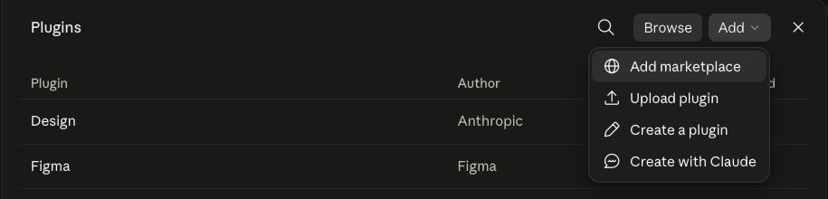
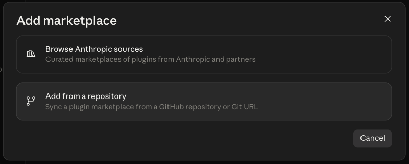
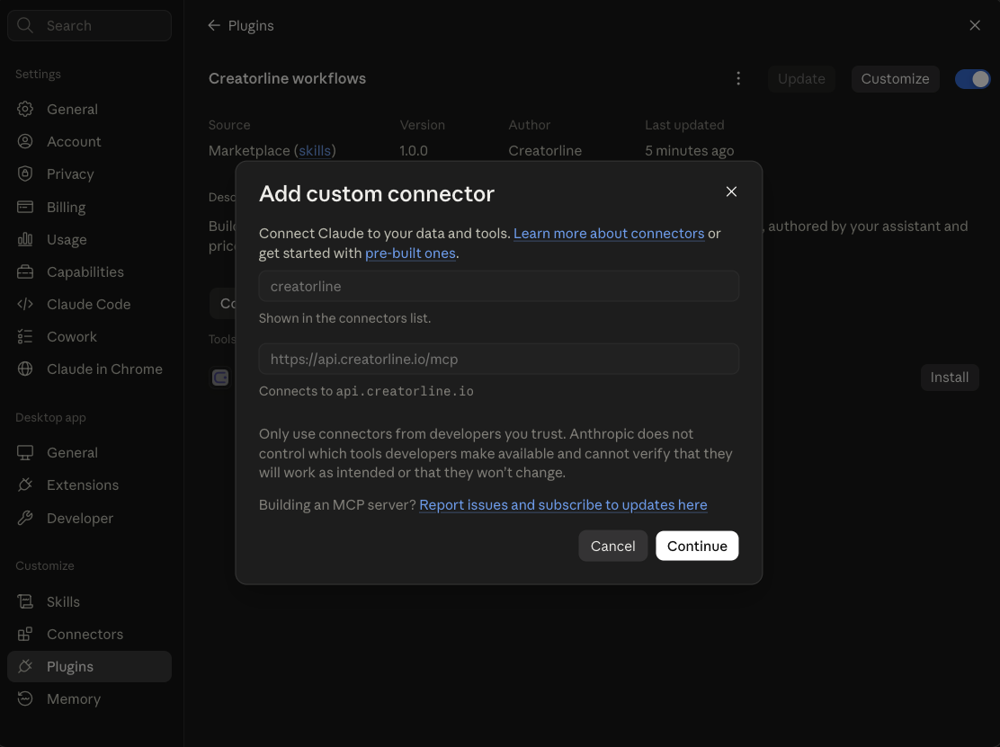
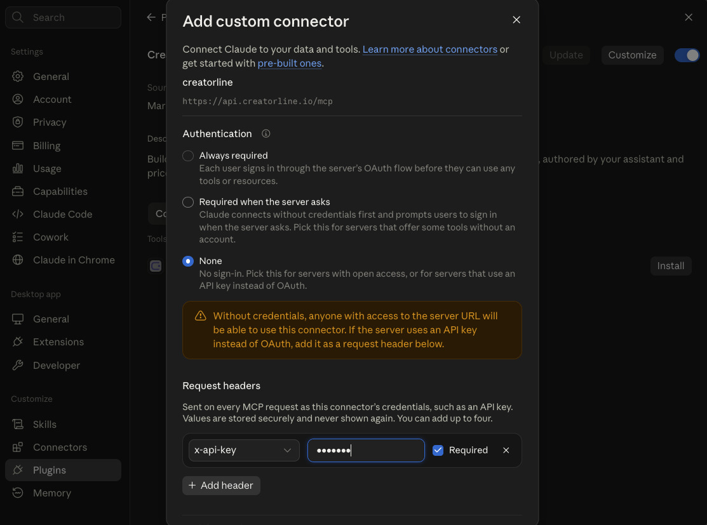

# Creatorline for your AI assistant

Say what you want. Your assistant builds the pipeline, tells you what it costs, and runs it.

Creatorline turns AI creators into finished video and photo content. This skill teaches your
assistant how to drive it, so you describe the result instead of wiring up a canvas.

## Things to ask for

- *"Make a 16 second stadium build time-lapse, demolition to opening night."*
- *"Recreate this pipeline on Creatorline"* — paste a screenshot from another tool
- *"A weekly product ad for the matcha account, going out Mondays."*
- *"Take my last workflow and make the hero shot sharper."*

It knows every model, what each one costs and which one suits the job. It picks, it prices it,
and it waits for your yes before spending anything. Finished posts wait in your review queue
until a person approves them, so nothing reaches an audience on its own.

## Add it to Claude

Four steps, no terminal.

### 1. Open Settings → Plugins, then Add → Add marketplace



### 2. Choose "Add from a repository" and paste the address

```text
https://github.com/Creatorline/skills
```



### 3. Install "Creatorline workflows", then press Continue

The plugin brings the connection with it, so the name and address are already filled in.



### 4. Choose "None", add your key, press Add

Creatorline uses an API key rather than a sign-in, so **None** is the right choice under
Authentication. Under **Request headers**, pick `x-api-key` and paste your key from
**Settings → API** in the Creatorline studio.



That is it. Ask for something and watch it build.

Claude stores your key and never shows it again. If you ever need to retire it, revoke that
key in **Settings → API** and add a new one here.

## Using a coding assistant instead

Claude Code, Cursor, Codex CLI, Windsurf, VS Code and Zed take the skill and the server
directly:

```bash
npx skills add Creatorline/skills --skill creatorline-workflows
claude mcp add --transport http creatorline https://api.creatorline.io/mcp \
  --header "Authorization: Bearer YOUR_API_KEY"
```
