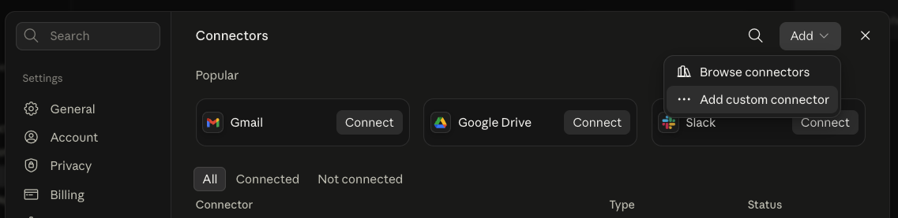
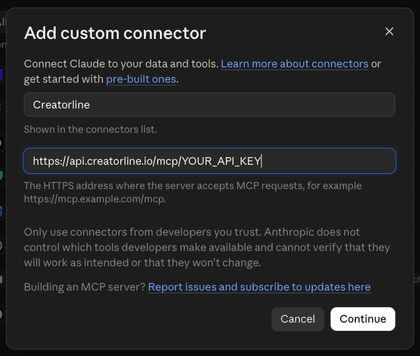

# Creatorline for your AI assistant

Say what you want. Your assistant builds the pipeline, tells you what it costs, and runs it.

Creatorline turns AI creators into finished video and photo content. This skill teaches your
assistant how to drive it, so you describe the result instead of wiring up a canvas.

## Things to ask for

- *"Make a 16 second stadium build time-lapse, demolition to opening night."*
- *"Recreate this pipeline on Creatorline"* — paste a screenshot from another tool
- *"A weekly product ad for the matcha account, going out Mondays."*
- *"Take my last workflow and make the hero shot sharper."*

It knows every model, what each one costs and which one suits the job. It picks, it prices it,
and it waits for your yes before spending anything. Finished posts wait in your review queue
until a person approves them, so nothing reaches an audience on its own.

## Connect it to Claude

**1.** In Claude, open **Settings → Connectors**, then **Add → Add custom connector**.



**2.** Name it Creatorline. Copy your key from **Settings → API** in the Creatorline studio and
paste it onto the end of this address:

```text
https://api.creatorline.io/mcp/YOUR_API_KEY
```



Leave the OAuth fields under **Advanced settings** empty, and press **Continue**.

> Keep that URL to yourself, the way you would a password: it contains your key. If it ever
> gets out, revoke that one key in **Settings → API** and paste a new URL.

**3.** Add the skill:

```bash
npx skills add Creatorline/skills --skill creatorline-workflows
```

That is it. Ask for something and watch it build.
